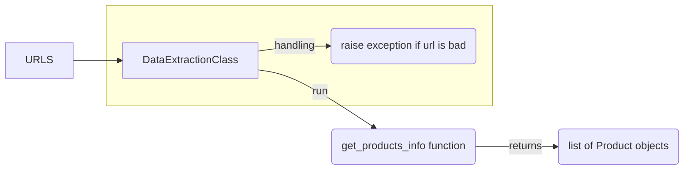

# P3 - Produse
<h2> Product aggregation project</h2> 

Team members:  
<ol>
  <li>Achim Catalin</li>
  <li>Dimcea Alexandra</li>
  <li>Petrasca Nicoleta</li>
</ol> 

Project Steps: 

<h2>#O1</h2> 
For this objective, the following python packages need to be installed. NOTE! If pip3 does not work, use just pip: 
 <ul>
  <li>extruct -> pip3 install extruct</li>
  <li>requests -> pip3 install requests</li>
  <li>w3lib -> pip3 install w3lib</li>
</ul> 

Description:  
<ol>
  <li>Implements the DataExtraction class that can be found in DataExtraction.py</li>
  <li>DataExtraction class is used to extract the metadata from a website (shopping website) and with it, we can extract the info about products from that website. The metadata contains the Schema.org info about that specific product and after the class extracts it, the class also parses that metadata and finds the information about that product ( name, price, reviews, and so on)</li>
  <li>DataExtraction class is initialized with a list of URLs to different products from websites, and after it extracts the info about each product it returns a list of Product objects. the Product class defines how a            product should look like. This way it will be easier to parse the products at the end</li>
  <li>In the main.py an example of how the DataExtraction class work is demonstrated and explained</li>
</ol> 

Workflow  

<h2>#O2</h2> 
For this objective, the following python packages need to be installed. NOTE! If pip3 does not work, use just pip: 
 <ul>
  <li>rdflib -> pip3 install rdflib</li>
</ul> 

Description:  
<ol>
  <li>This step implements the PersistenceDB class that is found in the Persistence.py file</li>
  <li>The PersistenceDB class converts the Product objects to the previous step in RDF and stores them in a TTL
  (turtle) file which acts like a small database stored on the disk</li>
  <li>The class appends new products to the database file and keeps the old data, this way we have access to
  the old data as well and the database role it's maintained </li>
</ol> 

<h2>#O3</h2> 
Description:  
<ol>
  <li>This step also uses the PersistenceDB class.</li>
  <li>Loads the TTL file in memory and from there it runs SPARQL queries in order to get the desired info about a product</li>
  <li>The class implements a few methods that retrieve the data and also it has the capability to add some filtering based on the user choice </li>
</ol> 
</ol> 

<h2>Bibliography:</h2> 
<ol>
  <li>rdflib - https://rdflib.readthedocs.io/en/stable/</li>
  <li>extruct - https://github.com/scrapinghub/extruct</li>
  <li>w3lib - https://w3lib.readthedocs.io/en/latest/</li>
</ol>
      
