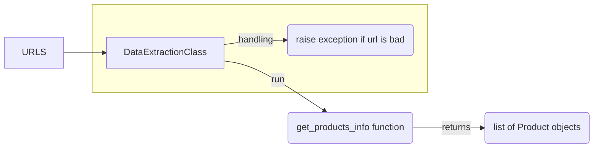

# Aggregation Project

Project Steps: 

<h2>#O1</h2> 
For this objective the following python packages needs to be installed: 
 <ul>
  <li>extruct -> pip3 install extruct</li>
  <li>requests -> pip3 install requests</li>
  <li>w3lib -> pip3 install w3lib</li>
</ul> 

Description:  
<ol>
  <li>Implements the DataExtraction class that can be found in DataExtraction.py</li>
  <li>DataExtraction class is used to extract the metadata from a website (shopping website) and with it we can extract the info about products drom that websites. The metadata contains the Schema.org info about that          specific product and after the class extracts it, the class also parse that metadata and find the information       about that prduct ( name, price, reviews and so on)</li>
  <li>DataExtraction class is initialized with a list of URLs to different products from websites, and after it    extracts the info about each product it returns a list of Product objects. the Product class defines how a            product should look like. This way it will be easier to parse the products at the end</li>
  <li>In the main.py an example of how the DataExtraction class work is demonstrated and explained</li>
</ol> 

Workflow  

      
